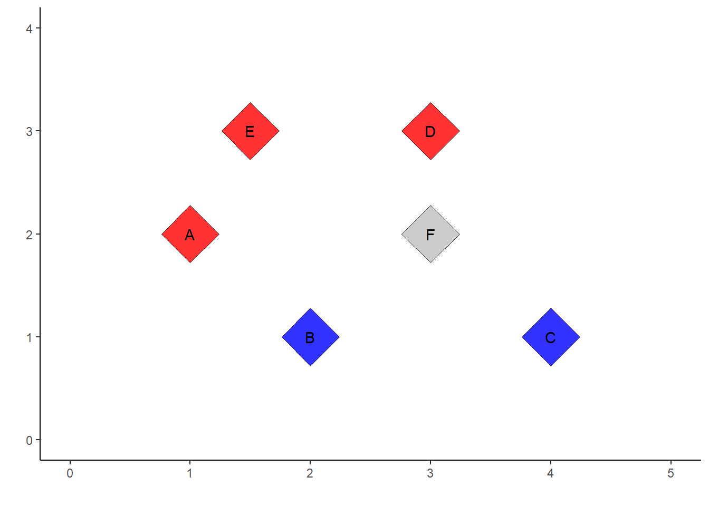

---
output:
  pdf_document: default
  html_document: default
header-includes:
- \usepackage{tikz}
- \usepackage{pgfplots}
- \usetikzlibrary{arrows,automata,positioning,calc}
- \usepackage[utf8]{inputenc}
- \usepackage[utf8]{vietnam}
- \usepackage{etoolbox}
- \usepackage{xcolor}
- \usepackage{hyperref}
- \usepackage{fontawesome5}
- \makeatletter
- \preto{\@verbatim}{\topsep=0pt \partopsep=-0pt}
- \makeatother
- \DeclareMathOperator*{\argmax}{arg\,max}
- \newcommand\tstrut{\rule{0pt}{3ex}}
- \newcommand\bstrut{\rule[-2.5ex]{0pt}{0pt}}
---

```
## 
## Attaching package: 'dplyr'
```

```
## The following objects are masked from 'package:stats':
## 
##     filter, lag
```

```
## The following objects are masked from 'package:base':
## 
##     intersect, setdiff, setequal, union
```

```
## 
## Attaching package: 'kableExtra'
```

```
## The following object is masked from 'package:dplyr':
## 
##     group_rows
```

```
## 
## Attaching package: 'gridExtra'
```

```
## The following object is masked from 'package:dplyr':
## 
##     combine
```


# Mô hình mạng neural network

Chương sách này thảo luận một chủ đề quan trọng có ứng dụng rộng rãi nhất trong lĩnh vực trí tuệ nhân tạo, đó là mô hình mạng học sâu. Tại thời điểm nhóm tác giả viết cuốn sách (2023), mạng học sâu là một lĩnh vực nghiên cứu tích cực nhất không chỉ trong khoa học máy tính, công nghệ thông tin mà còn cả trong các lĩnh vực khác như kinh tế, tài chính, y tế, xây dựng,... Nền tảng của mô hình mạng học sâu là mô hình mạng thần kinh nhân tạo (Neural Network). Mô hình neural network đã được biết đến đến rộng rãi vào cuối những năm 1980 bởi cách vận hành của mô hình mô tả lại cách thức mà hệ thống thần kinh của con người xử lý thông tin. Mặc dù các đặc tính của mô hình Neural Network được phân tích bởi những nhà toán học và nhà thống kê và các thuật toán liên quan đến mô hình này đã được cải thiện nhưng sau đó, do với sự ra đời của các phương pháp học máy khác như SVM, random forest, boosting,... các mô hình mạng nơ-ron phần nào không được ưa chuộng.

Từ những năm 2010, với nhu cầu xử lý các dữ liệu ngày càng phức tạp và sự ra đời của các kiến trúc máy tính lớn, mô hình mạng nơ-ron đã quay trở lại với tên mới là mạng học sâu (deep learning). Mạng học sâu vượt trội hoàn toàn các mô hình học máy thông thường trong phân loại hình ảnh/video và mô hình hóa ngôn ngữ tự nhiên bao gồm dữ liệu kiểu văn bản và lời nói (Natural Langugue Processing). Các nhà khoa học trong lĩnh vực này tin rằng lý do chính cho những thành công của mô hình mạng nơ-ron là sẵn có của các bộ dữ liệu để huấn luyện môn hình và cấu trúc của mô hình mạng nơ-ron có thể đáp ứng được với bất kỳ tập dữ liệu khổng lồ nào.


## Mạng neural với một layer duy nhất

### Hồi quy logistic là một mạng nơ-ron không có layer ẩn
Trước khi giới thiệu về cấu trúc của một mô hình mạng nơ-ron, chúng ta sẽ xem xét lại cách hồi quy logistic hoạt động. Sau đó, khi nhìn nhận cách vận hành của hổi quy logistic như một mạng nơ-ron đơn giản, bạn đọc sẽ có hình dung cụ thể hơn về cách xây dựng mô hình mạng nơ-ron. 

Dữ liệu dùng để xây dựng mô hình hồi quy logistic được xây dựng dựa trên dữ liệu bao gồm 5 quan sát được cho trong bảng dưới đây


<table class="table" style="margin-left: auto; margin-right: auto;">
<caption>(\#tab:unnamed-chunk-3)Dữ liệu cho hồi quy Logistic</caption>
 <thead>
  <tr>
   <th style="text-align:left;"> Dữ liệu </th>
   <th style="text-align:right;"> x1 </th>
   <th style="text-align:right;"> x2 </th>
   <th style="text-align:left;"> Màu sắc </th>
  </tr>
 </thead>
<tbody>
  <tr>
   <td style="text-align:left;"> A </td>
   <td style="text-align:right;"> 1.0 </td>
   <td style="text-align:right;"> 2 </td>
   <td style="text-align:left;"> blue </td>
  </tr>
  <tr>
   <td style="text-align:left;"> B </td>
   <td style="text-align:right;"> 2.0 </td>
   <td style="text-align:right;"> 1 </td>
   <td style="text-align:left;"> red </td>
  </tr>
  <tr>
   <td style="text-align:left;"> C </td>
   <td style="text-align:right;"> 4.0 </td>
   <td style="text-align:right;"> 1 </td>
   <td style="text-align:left;"> red </td>
  </tr>
  <tr>
   <td style="text-align:left;"> D </td>
   <td style="text-align:right;"> 3.0 </td>
   <td style="text-align:right;"> 3 </td>
   <td style="text-align:left;"> blue </td>
  </tr>
  <tr>
   <td style="text-align:left;"> E </td>
   <td style="text-align:right;"> 1.5 </td>
   <td style="text-align:right;"> 3 </td>
   <td style="text-align:left;"> blue </td>
  </tr>
  <tr>
   <td style="text-align:left;"> F </td>
   <td style="text-align:right;"> 3.0 </td>
   <td style="text-align:right;"> 2 </td>
   <td style="text-align:left;"> ? </td>
  </tr>
</tbody>
</table>



Với mỗi điểm dữ liệu bất kỳ, giả sử là điểm A có với các thuộc tính $x_1(A) = $ và $x_2(A) = $, chúng ta sẽ thực hiện hai phép biến đổi kế tiếp nhau:

- Phép biến đổi tuyển tính: với bộ 3 số thực bất kỳ $(b_0, b_1, b_2)$, chúng ta luôn có thể thực hiện phép biến đổi tuyến tính:

$$ 
A(1, x_1, x_2) \rightarrow b_0 \times 1 + b_1 \times x_1 + b_2 \times x_2
$$
- Phép biến đổi phi tuyến tính: chúng ta sử dụng hàm số $f(x) = sigmoid(x) = \cfrac{1}{1+e^{x}}$ để thực hiện phép biến đổi thứ hai

$$ 
b_0 + b_1 x_1 + b_2 x_2 \rightarrow \cfrac{1}{1+e^{b_0 + b_1 x_1 + b_2 x_2}}
$$
Sau khi thực hiện các phép biến đổi với từng điểm dữ liệu, chúng ta sẽ thu được với mỗi điểm dữ liệu một số nằm trong khoảng $(0,1)$. 


<table class="table" style="margin-left: auto; margin-right: auto;">
<caption>(\#tab:unnamed-chunk-4)Dữ liệu cho hồi quy Logistic</caption>
 <thead>
  <tr>
   <th style="text-align:left;"> Dữ liệu </th>
   <th style="text-align:right;"> $x_1$ </th>
   <th style="text-align:right;"> $x_2$ </th>
   <th style="text-align:left;"> Màu sắc </th>
   <th style="text-align:right;"> Biến mục tiêu ($y_i$) </th>
   <th style="text-align:left;"> Dữ liệu sau chuyển đổi ($p_i$) </th>
  </tr>
 </thead>
<tbody>
  <tr>
   <td style="text-align:left;"> A </td>
   <td style="text-align:right;"> 1.0 </td>
   <td style="text-align:right;"> 2 </td>
   <td style="text-align:left;"> blue </td>
   <td style="text-align:right;"> 1 </td>
   <td style="text-align:left;"> $(1+exp(b_0+ b_1+2 b_2))^{-1}$ </td>
  </tr>
  <tr>
   <td style="text-align:left;"> B </td>
   <td style="text-align:right;"> 2.0 </td>
   <td style="text-align:right;"> 1 </td>
   <td style="text-align:left;"> red </td>
   <td style="text-align:right;"> 0 </td>
   <td style="text-align:left;"> $(1+exp(b_0+2 b_1+ b_2))^{-1}$ </td>
  </tr>
  <tr>
   <td style="text-align:left;"> C </td>
   <td style="text-align:right;"> 4.0 </td>
   <td style="text-align:right;"> 1 </td>
   <td style="text-align:left;"> red </td>
   <td style="text-align:right;"> 0 </td>
   <td style="text-align:left;"> $(1+exp(b_0+4 b_1+ b_2))^{-1}$ </td>
  </tr>
  <tr>
   <td style="text-align:left;"> D </td>
   <td style="text-align:right;"> 3.0 </td>
   <td style="text-align:right;"> 3 </td>
   <td style="text-align:left;"> blue </td>
   <td style="text-align:right;"> 1 </td>
   <td style="text-align:left;"> $(1+exp(b_0+3 b_1+3 b_2))^{-1}$ </td>
  </tr>
  <tr>
   <td style="text-align:left;"> E </td>
   <td style="text-align:right;"> 1.5 </td>
   <td style="text-align:right;"> 3 </td>
   <td style="text-align:left;"> blue </td>
   <td style="text-align:right;"> 1 </td>
   <td style="text-align:left;"> $(1+exp(b_0+1.5 b_1+3 b_2))^{-1}$ </td>
  </tr>
</tbody>
</table>

Hàm tổn thất, tính bằng Cross Entropy qua năm điểm dữ liệu A, B, C, D, và E, sẽ là một hàm số của ba biến $(b_0, b_1, b_2)$ như sau

$$
Loss(b_0, b_1, b_2) = - \sum\limits_{Data = A}^E [y_i \times log(p_i) + (1-y_i) \times log(1-p_i)]
$$
với giá trị của $y_i$ và $p_i$ được cho bởi bảng ở trên. Bằng thuật toán gradient descent, chúng ta có thể tính toán được giá trị của $(b_0, b_1, b_2)$ sao cho hàm $Loss$ đạt giá trị nhỏ nhất bằng $(25,15,-30)$. Vậy có thể tính toán khả năng điểm $F$ có màu xanh là
$$
\mathbb{P}(F = blue) = (1+exp(25 + 3 \times 15 + 3 \times -30))^{-1} = 1
$$
Như vậy, trong hổi quy logistic, chúng ta đã sử dụng 2 phép biến đổi dữ liệu bao gồm một phép biến đổi tuyến tính thông qua một véc-tơ $b$ và sau đó là một phép biến đổi phi tuyến (hàm sigmoid) để thu được một giá trị duy nhất cho mỗi điểm dữ liệu. Quá trình ước lượng mô hình logistic là quá trình tìm kiếm các tham số $b$ sao cho giá trị đầu ra sau các phép biến đổi của mỗi điểm dữ liệu gần với kết quả mong muốn nhất có thể.


## Mạng neural với nhiều layer ẩn.

## Ước lượng tham số cho mạng neural network

### Backpropagation

### Regularization and Stochastic Gradient Descent

## Thực hành:

### Sử dụng mạng neural network trong phân loại văn bản.
### Sử dụng mạng neural network tích chập với dữ liệu $mnist()$.


<!-- # REFERENCE -->

<!-- ### Source from thesis -->

<!-- **1.** Chen, Chun-houh, Wolfgang Karl Härdle, and Antony Unwin, eds (2007). *Handbook of data visualization.* \ -->
<!-- **2.** Aparicio, Manuela, and Carlos J. Costa. (2015). *Data visualization - Communication design quarterly review.* \ -->
<!-- **3.** Hadley Wickham. (2010). *A Layered Grammar of Graphics.* \ -->

<!-- ### Souce from website -->

<!-- **4.** [https://www.tableau.com/learn/articles/data-visualization](https://www.tableau.com/learn/articles/data-visualization) \ -->
<!-- **5.** [https://www.r-graph-gallery.com/ggplot2-package.html](https://www.r-graph-gallery.com/ggplot2-package.html) \ -->
<!-- **6.** [http://r-statistics.co/ggplot2-Tutorial-With-R.html](http://r-statistics.co/ggplot2-Tutorial-With-R.html) \ -->
<!-- **7.** [https://www.maths.usyd.edu.au/u/UG/SM/STAT3022/r/current/Misc/data-visualization-2.1.pdf](https://www.maths.usyd.edu.au/u/UG/SM/STAT3022/r/current/Misc/data-visualization-2.1.pdf) \ -->
<!-- **8.** [https://www.kaggle.com/](https://www.kaggle.com/) \ -->
